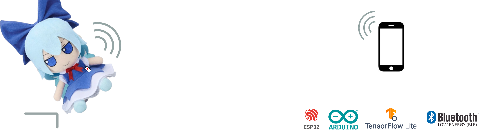
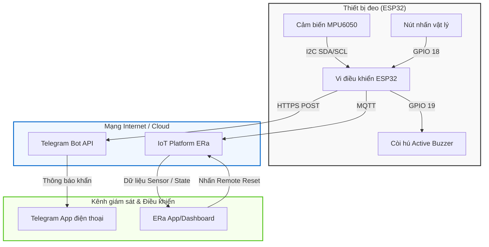
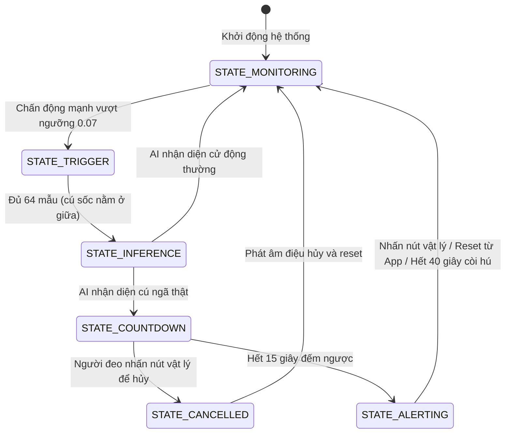
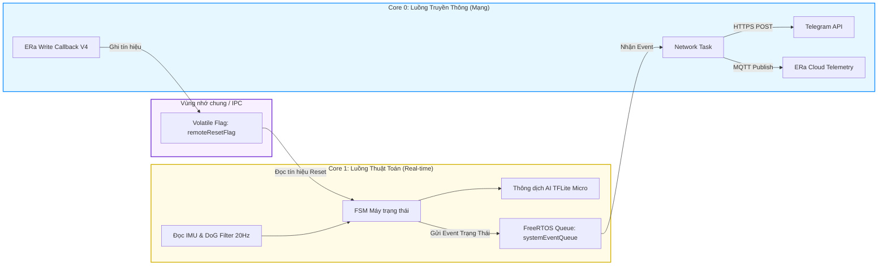

# Hệ Thống Phát Hiện Té Ngã ESP32 (TensorFlow Lite & Cloud Telemetry)



Dự án này triển khai một thiết bị đeo tay thông minh tự động phát hiện té ngã sử dụng vi điều khiển **ESP32** kết hợp cảm biến **IMU MPU6050**.

Hệ thống được thiết kế chạy song song đa nhân (Dual-Core FreeRTOS) để đảm bảo thời gian thực:

- **Core 1 (Main Loop):** Đọc cảm biến liên tục ở tần số 20Hz, chạy thuật toán lọc chấn động (DoG) và thông dịch mô hình mạng nơ-ron **TensorFlow Lite Micro** để phát hiện cú ngã.
- **Core 0 (Network Task):** Quản lý kết nối Wi-Fi, gửi cảnh báo tức thì về **Telegram Bot** và đồng bộ dữ liệu trạng thái thời gian thực lên **IoT Platform ERa**.

---

## Các tính năng nổi bật

- **Bộ lọc kép thông minh:** Lọc thô Naive (Difference of Gaussians & góc nghiêng) kết hợp bộ phân loại AI (CNN TFLite Micro) giúp triệt tiêu tối đa báo động giả.
- **Báo động cục bộ:** Còi báo động kêu bíp nhanh dần trong **15 giây** đếm ngược, cho phép người dùng nhấn nút vật lý trên thiết bị đeo để hủy nếu là báo động giả.
- **Báo động Cloud:** Tự động gửi cảnh báo khẩn kèm vị trí/thời gian về Telegram, còi hú lớn và đồng bộ lên ERa Dashboard.

---

## 1. Cấu Trúc Thư Mục Dự Án

```text
├── .pio/                          # Thư mục build của PlatformIO
├── images/                        # Hình ảnh minh họa dự án
├── lib/                           # Các thư viện cục bộ (FastIMU,...)
├── python_src/                    # Pipeline xử lý dữ liệu & train AI bằng Python
│   ├── data_collection_server.py  # Nhận data thô từ ESP32 qua Wi-Fi
│   ├── data_annotation_tool.py    # Giao diện gán nhãn sự kiện ngã phối hợp video
│   ├── main.py                    # Huấn luyện mô hình CNN & xuất mô hình TFLite
│   └── models/                    # Nơi lưu trữ mô hình xuất ra (.tflite, .h5)
├── src/                           # Mã nguồn Firmware ESP32 (C++)
│   ├── main.cpp                   # Máy trạng thái FSM & luồng xử lý chính
│   ├── env.cpp                    # Chứa thông tin Wi-Fi, Telegram Tokens
│   ├── DeviceIMU.cpp/.h           # Khởi tạo và cấu hình cảm biến MPU6050
│   ├── DeviceWifi.cpp/.h          # Quản lý kết nối Wi-Fi
│   ├── model.cpp/.h               # Mảng byte mã hóa mô hình AI nhúng vào ESP32
│   └── data_collection.cpp        # Code phụ phục vụ gom dữ liệu thô
├── diagram.json                   # Sơ đồ đấu nối linh kiện trên Wokwi Simulator
├── wokwi.toml                     # Cấu hình đường dẫn nạp firmware trên Wokwi
└── platformio.ini                 # Quản lý thư viện và cấu hình build PlatformIO
```

---

## 2. Yêu Cầu Phần Cứng & Đấu Nối (Cho chạy thật)

Nếu bạn phát triển bằng phần cứng thật, hãy chuẩn bị các linh kiện và kết nối theo sơ đồ sau:

### Linh kiện cần thiết:

1. **ESP32 DevKit V1** (hoặc NodeMCU-32S)
2. **Cảm biến MPU6050**
3. **Còi báo Active Buzzer**
4. **Nút nhấn vật lý (Push Button)**
5. Dây cắm breadboard và cáp nạp Micro-USB

### Sơ đồ nối dây (Pinout):

| Linh kiện   | Chân trên MPU6050/Còi/Nút | Chân trên ESP32 | Ghi chú                          |
| :---------- | :------------------------ | :-------------- | :------------------------------- |
| **MPU6050** | VCC                       | **3V3**         | Nguồn cấp cảm biến               |
|             | GND                       | **GND**         | Mass chung                       |
|             | SDA                       | **GPIO 21**     | Chân truyền dữ liệu I2C          |
|             | SCL                       | **GPIO 22**     | Chân tạo xung nhịp I2C           |
| **Buzzer**  | Chân dương (+)            | **GPIO 19**     | Điều khiển còi hú                |
|             | Chân âm (-)               | **GND**         | Mass chung                       |
| **Button**  | Một chân bất kỳ           | **GPIO 18**     | Sử dụng Pull-up nội (Active LOW) |
|             | Chân còn lại              | **GND**         | Kết nối trực tiếp với đất        |

### Bản đồ chân ảo trên IoT Platform ERa (Virtual Pins Map):

Để đồng bộ đúng các Widget trên Dashboard ứng dụng ERa, bạn cần cấu hình các chân ảo (Virtual Pins) như sau:

| Chân ảo (Virtual Pin) | Kiểu dữ liệu ERa | Tên hiển thị   | Ý nghĩa chức năng                                                                                 |
| :-------------------- | :--------------- | :------------- | :------------------------------------------------------------------------------------------------ |
| **V0**                | String           | Trạng thái FSM | Cho biết trạng thái FSM hiện tại (MONITORING, TRIGGER, INFERENCE, COUNTDOWN, ALERTING, CANCELLED) |
| **V1**                | Number           | Trạng thái ngã | Cảnh báo ngã (0 = Bình thường / An toàn, 1 = Phát hiện té ngã)                                    |
| **V2**                | String           | Lần ngã cuối   | Ghi lại mốc thời gian thực phát hiện cú ngã gần nhất (H:M:S D/M/Y)                                |
| **V3**                | Number           | Cường độ sóng  | Phần trăm cường độ sóng Wi-Fi (0 - 100%) quy đổi từ RSSI                                          |
| **V4**                | Number           | Reset từ xa    | Nút nhấn từ xa trên App để tắt còi báo động khẩn cấp và đưa thiết bị về giám sát                  |
| **V5**                | Number           | Uptime (giây)  | Thời gian hoạt động liên tục của thiết bị đeo tính từ lúc khởi động                               |
| **V6**                | Number           | Độ tin cậy AI  | Mức độ chính xác của AI nhận diện cú ngã tính theo phần trăm (0.0% - 100.0%)                      |
| **V7**                | Number           | Tổng lần ngã   | Đếm tích lũy tổng số lần té ngã đã được xác nhận của thiết bị đeo                                 |

---

## 3. Thiết Kế Kiến Trúc & Nguyên Lý Hoạt Động

Để giúp đồng đội mới nhanh chóng nắm bắt hệ thống hoạt động thế nào từ góc nhìn phần cứng đến phần mềm, dưới đây là 3 sơ đồ thiết kế cốt lõi của dự án:

### 3.1. Kiến Trúc Tổng Thể (Overall Architecture)

Sơ đồ thể hiện cách các thành phần phần cứng tương tác với vi điều khiển ESP32 và cách dữ liệu cảnh báo được đẩy lên các nền tảng Cloud qua Wi-Fi.



---

### 3.2. Máy Trạng Thế FSM (Finite State Machine)

Mạch logic chính của hệ thống được quản lý bởi một FSM chạy liên tục trên ESP32 để xử lý các giai đoạn từ lúc giám sát bình thường, phát hiện nghi ngờ chấn động, chạy AI cho đến đếm ngược và hú còi.



---

### 3.3. Chạy Song Song Đa Nhân & Hàng Đợi FreeRTOS (Dual-Core & IPC Queue)

Do các tác vụ kết nối mạng (gửi HTTPS Request cho Telegram, gửi MQTT lên ERa) thường bị trễ (blocking) từ 0.5s đến vài giây, dự án sử dụng cấu hình đa nhân của ESP32 để tránh làm gián đoạn việc đọc cảm biến liên tục ở tần số 20Hz:

- **Core 1:** Luôn luôn đảm bảo thời gian thực cho việc đọc mẫu gia tốc, tính toán bộ lọc và chạy TFLite.
- **Core 0:** Phụ trách kết nối mạng và Cloud.
- **IPC (Inter-Process Communication):** Sử dụng `FreeRTOS Queue` để Core 1 truyền trạng thái cho Core 0, và biến volatile `remoteResetFlag` để truyền tín hiệu Reset từ Core 0 ngược lại Core 1.



---

## 4. Hướng Dẫn Cài Đặt Nhanh (Quickstart)

### Bước 1: Chuẩn bị môi trường lập trình

1. Tải và cài đặt **VS Code** (Visual Studio Code).
2. Tìm và cài đặt extension **PlatformIO IDE** trên VS Code.
3. Cài đặt **Git** trên máy tính của bạn.

### Bước 2: Clone thư viện cảm biến

Mở terminal tại thư mục gốc của dự án này và chạy lệnh dưới đây để tải thư viện driver cảm biến:

```bash
cd lib
git clone https://github.com/LiquidCGS/FastIMU.git
```

### Bước 3: Cấu hình thông tin Wi-Fi & Telegram

Mở file [src/env.cpp](file:///c:/Hope/FellOffDetection/Fall-Detection-ESP32-TFLite-BLE/src/env.cpp) và điền đầy đủ cấu hình. Cấu trúc đầy đủ của file `env.cpp` bắt buộc phải như sau (bao gồm cả biến Wi-Fi doanh nghiệp để tránh lỗi biên dịch):

```cpp
#include "DeviceWifi.h"

// Cấu hình Wi-Fi thông thường (Mạng gia đình / Wokwi)
// - Chạy thật (Hardware): Điền SSID và Password Wi-Fi nhà bạn
// - Chạy giả lập (Wokwi): ssid = "Wokwi-GUEST", password = ""
char ssid[] = "TÊN_WIFI_CỦA_BẠN";
char password[] = "MẬT_KHẨU_WIFI";

// Cấu hình Wi-Fi Doanh nghiệp (WPA2 Enterprise / PEAP) - thường để trống đối với mạng gia đình
char identity[] = "";
char username[] = "";

// Cấu hình Telegram API (Lấy Token từ @BotFather và Chat ID từ @userinfobot)
char telegram_bot_token[] = "TOKEN_BOT_CỦA_BẠN";
char telegram_chat_id[] = "ID_CHAT_CỦA_BẠN";
```

### Bước 4: Nạp code lên board ESP32 thật

1. Kết nối ESP32 với máy tính qua cáp Micro-USB.
2. Nhấn biểu tượng con kiến (PlatformIO) ở thanh công cụ bên trái VS Code.
3. Nhấp vào mục **Build** để biên dịch mã nguồn.
4. Nhấp vào mục **Upload** để nạp chương trình vào ESP32.
5. Mở **Serial Monitor** (baudrate: `115200`) để quan sát thiết bị hoạt động.

---

## 5. Hướng Dẫn Chạy Mô Phỏng Trên Wokwi (Không cần phần cứng)

Dự án đã được cấu hình sẵn môi trường giả lập Wokwi. Bạn có thể test toàn bộ chuỗi tính năng gửi cảnh báo Telegram, hú còi, nhấn nút hủy trực tiếp trên máy tính.

### Các bước thực hiện:

1. Đảm bảo cấu hình Wi-Fi trong [src/env.cpp](file:///c:/Hope/FellOffDetection/Fall-Detection-ESP32-TFLite-BLE/src/env.cpp) đã đổi thành `"Wokwi-GUEST"` và `""`.
2. Chạy lệnh Build trên PlatformIO (hoặc nhấn nút Build) để sinh file `.bin` mới nhất.
3. Cài đặt extension **Wokwi Simulator** trên VS Code.
4. Nhấn phím `F1` (hoặc `Ctrl+Shift+P` / `Cmd+Shift+P`), gõ và chọn lệnh: `Wokwi: Start Simulator`. Trình mô phỏng sẽ hiện ra.

### Cách giả lập kích hoạt các sự kiện:

Để thuận tiện cho việc test mà không bị giới hạn bởi việc kéo các thanh trượt gia tốc MPU6050 bằng tay quá chậm, bạn có thể gửi lệnh qua **Serial Monitor** của Wokwi:

- **Giả lập ngã lập tức:** Gõ chữ `f` (hoặc `F`) rồi nhấn Enter.
  - _Hiện tượng:_ Hệ thống sẽ nhận diện "giả lập" cú ngã có độ tin cậy AI là 99%. Còi buzzer bắt đầu kêu bíp nhanh dần (giai đoạn đếm ngược 15s).
- **Hủy cảnh báo khi đang đếm ngược:** Nhấp chuột vào nút nhấn màu xanh lá cây trên mạch Wokwi (nhấn và giữ khoảng 0.5s) hoặc gõ chữ `c` (hoặc `C`) vào Serial Monitor.
  - _Hiện tượng:_ Còi bíp dừng hẳn, hệ thống phát một nhạc điệu xác nhận hủy rồi quay lại trạng thái giám sát bình thường (`MONITORING`).
- **Báo động đỏ (Kích hoạt gửi Telegram & ERa):** Gõ `f` và để hết 15 giây đếm ngược mà không nhấn nút hủy.
  - _Hiện tượng:_ Thiết bị gửi tin nhắn khẩn tới Telegram của bạn, đồng bộ trạng thái lên ERa Cloud và còi hú liên tục (kiểu còi xe cảnh sát).
- **Tắt báo động đỏ:** Click giữ nút nhấn màu xanh trên mạch hoặc gõ chữ `c` (hoặc `C`) trên Serial Monitor để ngắt còi hú và đưa hệ thống về trạng thái giám sát.

---

## 6. Quy Trình Huấn Luyện Lại Mô Hình AI (ML Pipeline)

Nếu nhóm của bạn muốn thu thập thêm dữ liệu hoặc thay đổi kiến trúc mô hình học máy:

### Cài đặt môi trường Python:

Mở Terminal ở thư mục dự án và chạy:

```bash
pipenv install
pipenv shell
```

### Các bước thực hiện:

1. **Thu thập dữ liệu thô:**
   - Thay đổi cấu hình `#define DATA_COLLECTION_MODE 1` trong file [main.cpp](file:///c:/Hope/FellOffDetection/Fall-Detection-ESP32-TFLite-BLE/src/main.cpp).
   - Nạp code vào ESP32.
   - Khởi chạy server nhận dữ liệu trên máy tính:
     ```bash
     python python_src/data_collection_server.py
     ```
2. **Gán nhãn dữ liệu:**
   - Gom các file dữ liệu cảm biến thu thập được kết hợp video quay lại quá trình ngã.
   - Sử dụng công cụ đồ họa trực quan để gán nhãn:
     ```bash
     python python_src/data_annotation_tool.py
     ```
3. **Huấn luyện mô hình:**
   - Khởi chạy file train:
     ```bash
     python python_src/main.py
     ```
   - File mô hình được tối ưu hóa dạng nén `.tflite` sẽ lưu tại `python_src/models/model.tflite`.
4. **Nhúng mô hình mới vào ESP32:**
   - Chuyển đổi file `.tflite` sang định dạng mảng byte C++ bằng công cụ `xxd`:
     ```bash
     xxd -i python_src/models/model.tflite > src/model.cpp
     ```
   - Sửa cấu hình `#define DATA_COLLECTION_MODE 0` trong [main.cpp](file:///c:/Hope/FellOffDetection/Fall-Detection-ESP32-TFLite-BLE/src/main.cpp) rồi biên dịch nạp lại firmware cho ESP32.
