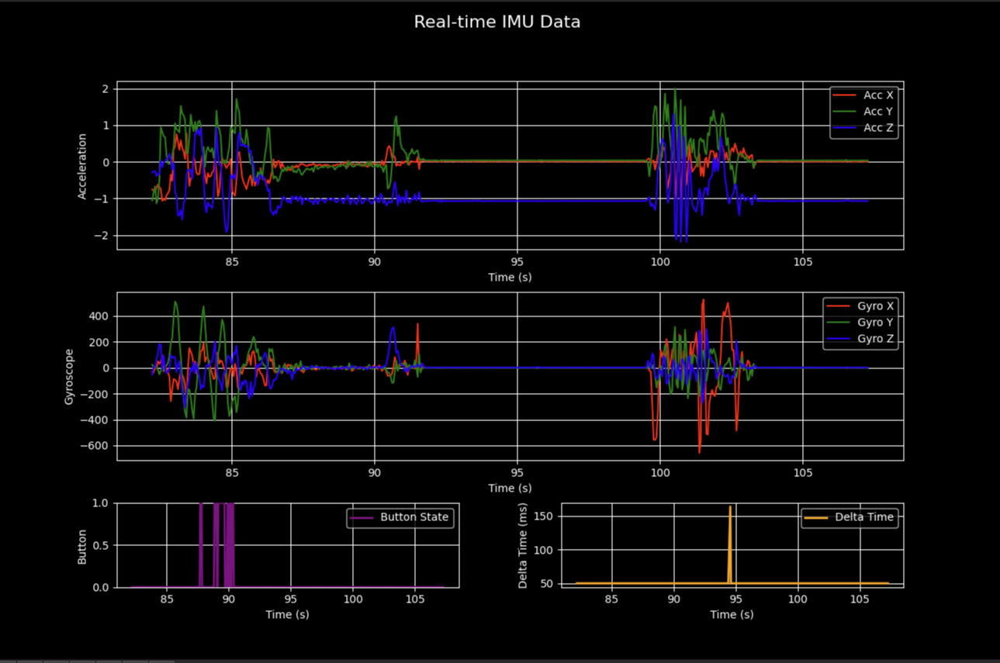

# Phát Hiện Té Ngã trên ESP32 với TensorFlow Lite và BLE

Dự án này triển khai một hệ thống phát hiện té ngã sử dụng vi điều khiển ESP32 được trang bị cảm biến IMU (Đơn vị Đo lường Quán tính). Hệ thống thu thập dữ liệu chuyển động và một thuật toán dựa trên ngưỡng cơ bản (naive threshold-based) chạy theo thời gian thực để phát hiện các nguy cơ té ngã. Khi phát hiện một vụ té ngã tiềm ẩn, mô hình TensorFlow Lite sẽ được sử dụng để phân loại sự kiện một cách chính xác hơn. Nếu xác nhận có té ngã, ESP32 bắt đầu đếm ngược, và nếu không bị hủy bỏ, thiết bị sẽ phát tín hiệu quảng bá Bluetooth Low Energy (BLE) thông báo rằng sự cố té ngã đã xảy ra.

## Biên Dịch Firmware ESP32

- `cd lib && git clone it@github.com:LiquidCGS/FastIMU.git`
- Các thư viện phụ thuộc khác được liệt kê trong `platformio.ini`.
- Sử dụng PlatformIO để biên dịch dự án và nạp (flash) vào thiết bị ESP32.

## Huấn Luyện Mô Hình

- Các gói Python cần thiết nằm trong pipfile (sử dụng `pipenv`)
- `cd python_src && python main.py`
- Mô hình đã huấn luyện được lưu dưới dạng `top_model.keras` tại `python_src/models/`
- Mô hình TFLite sau khi chuyển đổi được lưu dưới dạng `model.tflite` tại `python_src/models/`
- Sử dụng lệnh `xxd -i model.tflite > model.cpp` để chuyển đổi mô hình TFLite thành file nguồn C++ nhằm nhúng vào firmware.
- Sao chép `model.cpp` vào thư mục `src/` của dự án firmware.

### Server Thu Thập Dữ Liệu

`python_src/data_collection_server.py`. Lắng nghe dữ liệu phát trực tiếp qua Wifi từ thiết bị đeo và hiển thị đồ thị theo thời gian thực. Lưu dữ liệu nhận được vào file CSV để sử dụng trong quá trình huấn luyện.

### Công Cụ Gán Nhãn Dữ Liệu (Data Annotation Helper)

`python_src/annotate_data.py`. Được thiết kế để gán nhãn thủ công cho các sự kiện té ngã trong dữ liệu cảm biến và video đã được đồng bộ hóa. Đồng thời hiển thị các chỉ số tùy chỉnh dựa trên dữ liệu vốn được dùng để tạo ra thuật toán phát hiện té ngã cơ bản.

## Các công cụ khác

- Để tìm các tham số tối ưu cho thuật toán phát hiện té ngã cơ bản, sử dụng `python_src/experiments.py`. (Sử dụng tối ưu hóa Bayesian để tìm kiếm trong không gian tham số.)
- Server phát hiện té ngã: `python_src/fall_detection_server.py`. Lắng nghe các tín hiệu quảng bá BLE "Fallen" từ thiết bị đeo và nhấp nháy một số đèn LED cụ thể bằng các chân GPIO trên Raspberry Pi bất cứ khi nào phát hiện té ngã. Công cụ này có thể được mở rộng để gửi thông báo đẩy (push notification) tới người thân hoặc cảnh báo cho dịch vụ cấp cứu.
- Mã nguồn ESP32 thu thập dữ liệu: `src/data_collection.cpp`. Định kỳ gửi các cửa sổ dữ liệu IMU gối lên nhau (overlapping windows) tới server thu thập dữ liệu qua Wifi. Phương thức này khá thiếu ổn định do thường xuyên bị mất gói tin. Yêu cầu có file "env.cpp" chứa thông tin đăng nhập Wifi.
