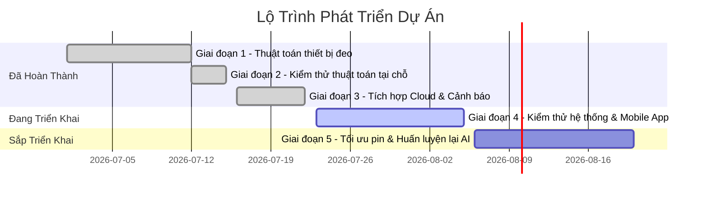

# Lộ Trình Phát Triển Dự Án (Project Roadmap)
## Hệ Thống Phát Hiện Té Ngã Đeo Tay Dùng ESP32, TensorFlow Lite Micro và IoT Platform

Tài liệu này cập nhật lộ trình phát triển chiến lược của dự án hệ thống phát hiện té ngã đeo tay. Kiến trúc được thiết kế để kết nối Wi-Fi trực tiếp từ thiết bị đeo đến nền tảng IoT và các dịch vụ cảnh báo đám mây, giúp tối ưu hóa chi phí phần cứng và tăng tính khả thi cho việc triển khai thực tế.

---

## Tóm Tắt Lộ Trình (Roadmap Overview)

| Giai đoạn | Nội dung công việc chính | Trạng thái |
| :--- | :--- | :--- |
| **Giai đoạn 1** | Xây dựng thuật toán thiết bị đeo (Đọc cảm biến, bộ lọc chấn động DoG, nhúng mô hình AI TFLite Micro) | **Đã hoàn thành** |
| **Giai đoạn 2** | Kiểm thử thuật toán tại chỗ (Xác minh độ chính xác của bộ lọc thô và tốc độ tính toán mô hình AI) | **Đã hoàn thành** |
| **Giai đoạn 3** | Tích hợp các dịch vụ đám mây (Kết nối Wi-Fi, tích hợp IoT Platform ERa, gửi cảnh báo Telegram Bot) | **Đã hoàn thành** |
| **Giai đoạn 4** | Kiểm thử liên thông hệ thống (System Validation) & Tối ưu hóa giao diện ứng dụng di động (Mobile App Dashboard) | **Đang triển khai** (Trọng tâm hiện tại) |
| **Giai đoạn 5** | Tối ưu hóa tiêu thụ năng lượng (Deep Sleep) & Thu thập dữ liệu cải tiến mô hình AI | **Kế hoạch** |

---

## Chi Tiết Các Giai Đoạn

### Giai đoạn 1: Xây dựng thuật toán thiết bị đeo (Đã hoàn thành)
*   **Mục tiêu:** Xây dựng phần mềm nhúng xử lý dữ liệu cảm biến thời gian thực trên ESP32.
*   **Các kết quả đạt được:**
    *   Thu thập dữ liệu gia tốc và góc nghiêng từ cảm biến IMU qua giao tiếp I2C.
    *   Phát triển thuật toán lọc thô sử dụng bộ lọc sai khác Gauss (DoG) kết hợp góc nghiêng để phát hiện các chấn động mạnh nghi ngờ ngã.
    *   Nhúng thành công mô hình mạng nơ-ron CNN thông qua trình thông dịch TensorFlow Lite Micro để chạy phân loại thứ cấp.
    *   Thiết lập cơ chế đếm ngược báo động giả cục bộ (15 giây) kết hợp âm thanh còi báo và nút nhấn hủy.

### Giai đoạn 2: Kiểm thử thuật toán tại chỗ (Đã hoàn thành)
*   **Mục tiêu:** Đảm bảo mã nguồn biên dịch thành công và mô hình AI chạy ổn định trên phần cứng với tài nguyên tối ưu.
*   **Các kết quả đạt được:**
    *   Thiết lập và đồng bộ thành công môi trường biên dịch PlatformIO.
    *   Xác minh tốc độ suy diễn của mô hình AI trên chip ESP32 (đạt thời gian xử lý thực tế dưới 1 giây).
    *   Tối ưu hóa bộ nhớ để chương trình hoạt động ổn định không xảy ra lỗi tràn bộ nhớ (RAM/Flash).

### Giai đoạn 3: Tích hợp các dịch vụ đám mây (Đã hoàn thành)
*   **Mục tiêu:** Kết nối thiết bị đeo trực tiếp với Internet để truyền dữ liệu và kích hoạt cảnh báo khẩn cấp từ xa.
*   **Các kết quả đạt được:**
    *   Kết nối trực tiếp Wi-Fi từ ESP32 lên hạ tầng mạng.
    *   Tích hợp dịch vụ Telegram Bot API gửi tin nhắn cảnh báo tức thì (HTTPS POST) trực tiếp từ thiết bị đeo đến điện thoại người nhà.
    *   Đồng bộ hóa dữ liệu trạng thái FSM, thời gian ngã, độ tin cậy AI và các thông số telemetry lên IoT Platform ERa (MQTT).
    *   Hỗ trợ cơ chế Reset từ xa (Remote Reset) để tắt còi báo động từ ứng dụng đám mây.
    *   Giả lập và xác minh thành công toàn bộ chuỗi tính năng trên môi trường giả lập Wokwi.

---

### Giai đoạn 4: Kiểm thử liên thông hệ thống & Tích hợp ứng dụng di động (Đang triển khai)
*   **Mục tiêu:** Đánh giá độ tin cậy của toàn bộ hệ thống từ thiết bị đến ứng dụng đầu cuối và hoàn thiện trải nghiệm người dùng trên thiết bị di động.
*   **Nội dung công việc chính:**
    *   **Kiểm thử liên thông (System Validation):** Đo lường và đánh giá các chỉ số vận hành thực tế như thời gian phản hồi tin nhắn Telegram, độ trễ đồng bộ đám mây, tỉ lệ kết nối lại Wi-Fi thành công khi mất mạng.
    *   **Tích hợp App di động (Mobile Integration):** Thiết kế giao diện (Dashboard) thân thiện trên ứng dụng di động ERa, cấu hình các Widget điều khiển trực quan (bảng trạng thái, đồ thị, lịch sử cảnh báo).
    *   **Thông báo đẩy (Mobile Push Notification):** Thiết lập cơ chế tự động gửi thông báo khẩn cấp (Push Alert) trên điện thoại người chăm sóc khi nhận tín hiệu ngã từ cloud.

---

### Giai đoạn 5: Tối ưu hóa năng lượng & Thu thập dữ liệu cải tiến mô hình AI (Kế hoạch)
*   **Mục tiêu:** Kéo dài thời hạn sử dụng pin và nâng cấp độ chính xác nhận diện của hệ thống trong dài hạn.
*   **Nội dung công việc chính:**
    *   **Tối ưu hóa tiêu thụ năng lượng:** Cấu hình tính năng phát hiện chuyển động phần cứng (Wake-on-Motion - WoM) của cảm biến để điều khiển chế độ ngủ sâu (Deep Sleep) trên ESP32. Thiết bị chỉ thức dậy khi có chấn động mạnh để tiết kiệm pin.
    *   **Thu thập dữ liệu thực tế bổ sung:** Sử dụng chế độ thu thập dữ liệu thô (Data Collection Mode) để ghi nhận thêm các hoạt động thường ngày của người đeo.
    *   **Huấn luyện lại AI:** Cập nhật bộ dữ liệu thực tế, huấn luyện lại mô hình CNN để giảm tối đa tỉ lệ cảnh báo giả (False Alarms) và nhúng lại vào ESP32.
