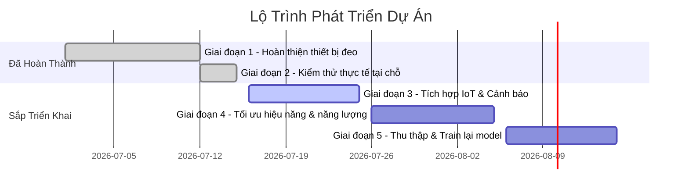
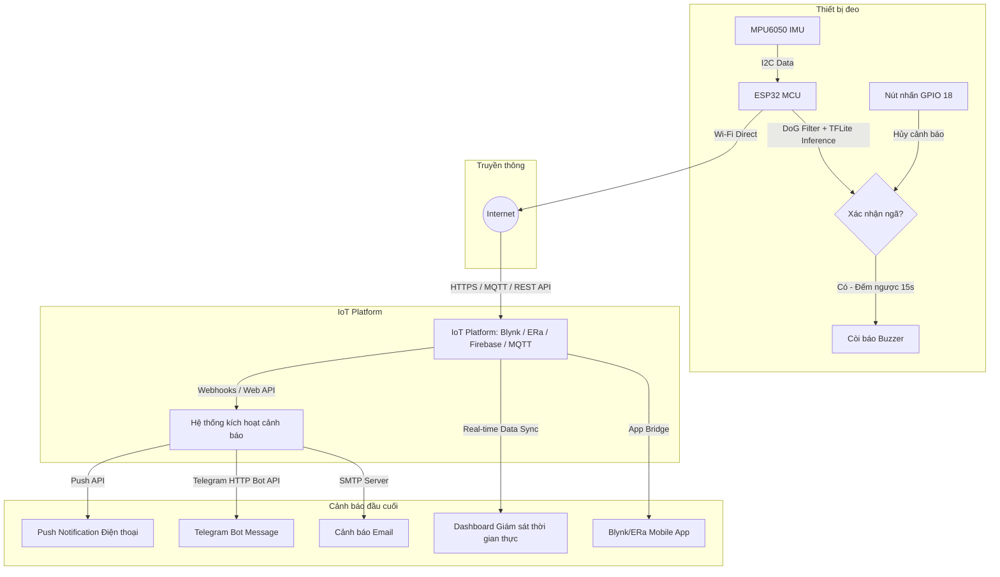

# Lộ Trình Phát Triển Dự Án (Project Roadmap)
## Hệ Thống Phát Hiện Té Ngã Đeo Tay Dùng ESP32, TensorFlow Lite Micro và IoT Platform

Tài liệu này cập nhật lộ trình phát triển của dự án hệ thống phát hiện té ngã đeo tay. Kiến trúc được thiết kế lại để loại bỏ hoàn toàn Gateway BLE và Raspberry Pi, thay vào đó sử dụng kết nối Wi-Fi trực tiếp từ thiết bị đeo đến nền tảng IoT (IoT Platform) để tối ưu hóa chi phí phần cứng và tăng tính khả thi cho việc triển khai thực tế.

---

## Tóm Tắt Lộ Trình (Roadmap Overview)

| Giai đoạn | Nội dung công việc | Trạng thái |
| :--- | :--- | :--- |
| **Giai đoạn 1** | Hoàn thiện thiết bị đeo (Mã nguồn ESP32, TFLite Micro, bộ lọc DoG) | **Đã hoàn thành** |
| **Giai đoạn 2** | Kiểm thử thực tế tại chỗ (Biên dịch firmware, xác minh thuật toán thô) | **Đã hoàn thành** |
| **Giai đoạn 3** | Tích hợp IoT Platform và hệ thống cảnh báo từ xa | **Sắp triển khai** (Trọng tâm hiện tại) |
| **Giai đoạn 4** | Tối ưu hóa hiệu năng và năng lượng (Deep Sleep, Motion Interrupt) | **Kế hoạch** |
| **Giai đoạn 5** | Thu thập dữ liệu bổ sung và huấn luyện lại mô hình (Chỉ khi cần thiết) | **Kế hoạch** |

---

## Chi Tiết Các Giai Đoạn

### Giai đoạn 1: Hoàn thiện thiết bị đeo (Đã hoàn thành)
*   **Mục tiêu:** Xây dựng phần mềm nhúng hoàn chỉnh trên thiết bị đeo ESP32.
*   **Công việc thực hiện:**
    *   Tích hợp cảm biến MPU6050 (đọc dữ liệu gia tốc và góc nghiêng) qua giao tiếp I2C ([DeviceIMU.cpp](file:///c:/Hope/FellOffDetection/Fall-Detection-ESP32-TFLite-BLE/src/DeviceIMU.cpp)).
    *   Xây dựng thuật toán lọc thô Naive sử dụng kernel Difference of Gaussians (DoG) và góc nghiêng để phát hiện chấn động mạnh nghi ngờ ngã ([main.cpp](file:///c:/Hope/FellOffDetection/Fall-Detection-ESP32-TFLite-BLE/src/main.cpp#L98-L123)).
    *   Nhúng trình thông dịch TensorFlow Lite Micro và mảng byte mô hình CNN đã huấn luyện sẵn ([model.cpp](file:///c:/Hope/FellOffDetection/Fall-Detection-ESP32-TFLite-BLE/src/model.cpp)) để chạy phân loại thứ cấp thời gian thực.
    *   Thiết lập cơ chế đếm ngược báo động giả (15 giây) sử dụng nút nhấn ([GPIO 18](file:///c:/Hope/FellOffDetection/Fall-Detection-ESP32-TFLite-BLE/src/main.cpp#L17)) để hủy báo động, kết hợp còi báo Buzzer ([GPIO 19](file:///c:/Hope/FellOffDetection/Fall-Detection-ESP32-TFLite-BLE/src/main.cpp#L18)).

### Giai đoạn 2: Kiểm thử thực tế tại chỗ (Đã hoàn thành)
*   **Mục tiêu:** Đảm bảo firmware biên dịch thành công và thuật toán phát hiện chạy ổn định trên phần cứng thực tế.
*   **Công việc thực hiện:**
    *   Cấu hình môi trường PlatformIO ([platformio.ini](file:///c:/Hope/FellOffDetection/Fall-Detection-ESP32-TFLite-BLE/platformio.ini)) tích hợp thư viện TFLite Micro và các driver cảm biến.
    *   Chuyển cấu hình chương trình sang chế độ chạy thực tế (`#define DATA_COLLECTION_MODE 0`) trên cả [main.cpp](file:///c:/Hope/FellOffDetection/Fall-Detection-ESP32-TFLite-BLE/src/main.cpp#L1) và [data_collection.cpp](file:///c:/Hope/FellOffDetection/Fall-Detection-ESP32-TFLite-BLE/src/data_collection.cpp#L1).
    *   Biên dịch thành công mã nguồn với mức tiêu thụ tài nguyên tối ưu: **RAM 30.5%** (99.8 KB), **Flash 68.0%** (891.2 KB).

---

### Giai đoạn 3: Tích hợp IoT Platform và hệ thống cảnh báo từ xa (Sắp triển khai)

#### A. Mục tiêu của giai đoạn
Kết nối thiết bị đeo ESP32 trực tiếp với Internet để gửi cảnh báo té ngã tức thời lên đám mây (IoT Cloud), từ đó kích hoạt các kênh cảnh báo từ xa (App di động, Push Notification, Telegram, Email, Dashboard) đến người nhà hoặc nhân viên y tế mà không cần thiết bị trung gian.

#### B. Kiến trúc hệ thống

#### C. Các bước triển khai kỹ thuật
1.  **Lựa chọn IoT Platform phù hợp:**
    *   *Phương án 1 (Blynk / ERa):* Phù hợp để tạo nhanh Mobile App, Dashboard giám sát trực quan và tích hợp sẵn công cụ đẩy Notification/Email.
    *   *Phương án 2 (Firebase Realtime Database / MQTT):* Phù hợp nếu muốn tự viết Web/App Dashboard tùy biến và sử dụng Cloud Functions/Node-RED để kích hoạt Telegram Bot API.
2.  **Cập nhật Firmware trên ESP32:**
    *   Tích hợp thư viện kết nối IoT Platform tương ứng (ví dụ: `BlynkSimpleEsp32.h` hoặc thư viện MQTT `PubSubClient`).
    *   Khi luồng phân loại trong [main.cpp](file:///c:/Hope/FellOffDetection/Fall-Detection-ESP32-TFLite-BLE/src/main.cpp#L139-L146) chuyển trạng thái thành `Fall confirmed` (Quá 15s đếm ngược mà không nhấn nút hủy):
        *   ESP32 thiết lập kết nối Wi-Fi.
        *   Gửi bản tin khẩn cấp (JSON payload hoặc Virtual Pin write) lên IoT Platform chứa trạng thái ngã và thời gian xảy ra.
3.  **Cấu hình luồng xử lý sự kiện trên Cloud (Alert Automation):**
    *   Thiết lập Webhook hoặc Rule Engine trên IoT Platform để khi biến trạng thái ngã được cập nhật thành `1` (True):
        *   Kích hoạt gửi tin nhắn đến Telegram API chứa nội dung: `"CẢNH BÁO: Phát hiện té ngã lúc [Thời gian]!"`.
        *   Gửi email khẩn cấp đến danh sách người chăm sóc.
        *   Gửi Push Notification có độ ưu tiên cao nhất lên điện thoại thông minh thông qua Mobile App.
4.  **Thiết kế Dashboard Giám sát:**
    *   Tạo giao diện web/app hiển thị: Trạng thái hiện tại (Bình thường / Đã ngã), Nút xác nhận an toàn từ xa, và Lịch sử các lần ngã trước đó.

#### D. Kết quả mong đợi
*   ESP32 gửi gói tin cảnh báo lên IoT Cloud thành công trong vòng **< 2 giây** sau khi hết thời gian đếm ngược.
*   Người chăm sóc nhận được cảnh báo đa kênh (Telegram, App Push, Email) trong vòng **< 5 giây** kể từ khi hệ thống đám mây nhận được tín hiệu.
*   Dashboard cập nhật trạng thái thời gian thực chính xác.

---

### Giai đoạn 4: Tối ưu hiệu năng và năng lượng (Kế hoạch)
*   **Mục tiêu:** Kéo dài thời gian sử dụng pin của thiết bị đeo để có thể hoạt động liên tục tối thiểu từ 3 - 5 ngày.
*   **Công việc dự kiến:**
    *   Cấu hình tính năng **Wake-on-Motion (WoM)** của cảm biến MPU6050 để xuất tín hiệu ngắt (Interrupt) qua chân GPIO vật lý của ESP32.
    *   Đưa ESP32 vào chế độ **Deep Sleep** (tiêu thụ dòng điện ở mức vài chục micro-ampe). Vi điều khiển chỉ thức dậy hoàn toàn khi MPU6050 phát hiện gia tốc vượt ngưỡng kích hoạt WoM.
    *   Tối ưu hóa thời gian kết nối Wi-Fi bằng cách lưu thông tin IP tĩnh (Static IP) và bộ nhớ cache mạng để quá trình kết nối và gửi dữ liệu khi thức dậy diễn ra nhanh nhất (< 1.5 giây).

### Giai đoạn 5: Thu thập dữ liệu bổ sung và huấn luyện lại mô hình (Chỉ thực hiện khi cần thiết)
*   **Mục tiêu:** Nâng cao độ chính xác của mô hình TFLite trong môi trường thực tế nếu tỷ lệ báo động giả (False Positives) hoặc bỏ sót ngã (False Negatives) cao.
*   **Công việc dự kiến:**
    *   Sử dụng chế độ `DATA_COLLECTION_MODE 1` đã xây dựng để thu thập thêm dữ liệu từ các tư thế ngã đa dạng của chính người đeo thực tế.
    *   Sử dụng công cụ [data_annotation_tool.py](file:///c:/Hope/FellOffDetection/Fall-Detection-ESP32-TFLite-BLE/python_src/data_annotation_tool.py) để gán nhãn lại.
    *   Huấn luyện lại mô hình CNN ([main.py](file:///c:/Hope/FellOffDetection/Fall-Detection-ESP32-TFLite-BLE/python_src/main.py)), chuyển đổi sang tflite và cập nhật [model.cpp](file:///c:/Hope/FellOffDetection/Fall-Detection-ESP32-TFLite-BLE/src/model.cpp).
